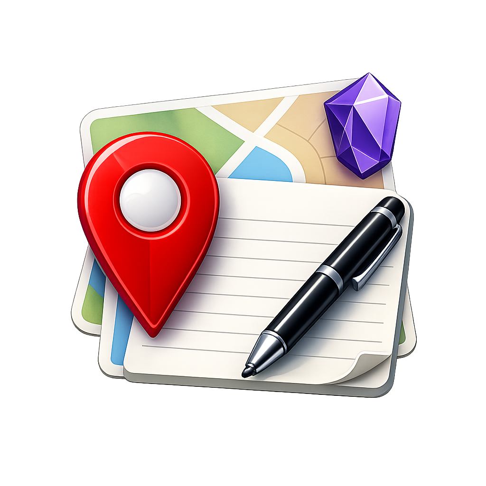

<p align="center">
  
</p>

# Geocode Note

An [Obsidian](https://obsidian.md) plugin that adds geographic metadata to your notes — coordinates, marker icon, and color — stored in the YAML frontmatter.

Designed to work seamlessly with map plugins like [Obsidian Map View](https://github.com/esm7/obsidian-map-view).

## Features

- **Four ways to set coordinates:**
  - **Current location** — Uses device geolocation (GPS on mobile, IP-based fallback on desktop)
  - **Address search** — Powered by [OpenStreetMap Nominatim](https://nominatim.openstreetmap.org/) (free, no API key needed)
  - **Manual entry** — Type latitude and longitude directly
  - **Draggable map marker** — Fine-tune the position on an interactive [Leaflet](https://leafletjs.com/) map (CartoCDN tiles); the address is refreshed via reverse geocoding
- **Resolved address saved to frontmatter** — Keeps the human-readable address alongside the coordinates
- **Update mode** — Reopen a previously geocoded note and the modal reloads existing coordinates, icon, color and address for quick edits
- **Prefill from note content** — Configure the plugin to prefill the address search from the note title or from the frontmatter `address` field
- **Icon picker** — 42 icons from [Lucide](https://lucide.dev/) organized in 4 categories (Places, Nature, Transport, Activities)
- **Color picker** — 10 color options for your map marker
- **Mobile-friendly** — Responsive UI with large touch targets, works on both phone and desktop
- **No API key required** — All services used are free and open

## Frontmatter format

The plugin writes the following fields to your note's YAML frontmatter:

```yaml
---
coordinates:
  - "48.85837"
  - "2.294481"
icon: "landmark"
color: "red"
address: "Tour Eiffel, 5, Avenue Anatole France, Paris, France"
---
```

| Field | Description |
|-------|-------------|
| `coordinates` | Array of two strings: latitude and longitude |
| `icon` | Lucide icon name for the map marker |
| `color` | Color name for the map marker |
| `address` | Human-readable address resolved from the geocoder (omitted when coordinates come from manual entry or pure geolocation) |

## Usage

### Opening the plugin

**Option 1:** Click the **map pin** icon in the left ribbon.

**Option 2:** Open the command palette (`Ctrl/Cmd + P`) and search for **"Geocode current note"**.

### Setting coordinates

1. **Current location** — Click "My current location". On mobile, the device GPS is used. On desktop, an approximate IP-based location is provided.
2. **Address search** — Type an address in the search field and press Enter or click the search button. The first result from OpenStreetMap is used, and its full address is stored in the `address` frontmatter field.
3. **Manual entry** — Click "Enter coordinates manually" to reveal latitude/longitude fields.
4. **Fine-tune on the map** — Once coordinates are set, a Leaflet map appears. Drag the marker to adjust the position; the `address` field is refreshed automatically via reverse geocoding.

### Choosing an icon

Select an icon from the visual grid. Icons are grouped into categories:

| Category | Examples |
|----------|---------|
| Places | Pin, Home, Building, Landmark, Church, Castle, Hotel, Hospital... |
| Nature | Tree, Pine, Forest, Mountain, Flower, Camping, Sea... |
| Transport | Car, Bus, Train, Plane, Ship, Bike, Gas station... |
| Activities | Coffee, Restaurant, Bar, Shopping, Gym, Music, Photo... |

### Choosing a color

Click one of the 10 color circles: red, blue, green, orange, purple, yellow, pink, teal, gray, or black.

### Saving

Click **"Save"** to write the coordinates, icon, color and address to the note's frontmatter.

### Updating an existing note

If the active note already contains geocoding data, opening the modal switches to **update mode**: the existing coordinates, icon, color and address are preloaded, the map is centered on the current position, and saving overwrites the frontmatter fields in place.

## Settings

Open **Settings → Community plugins → Geocode Note** to configure:

| Option | Values | Description |
|--------|--------|-------------|
| **Prefill search field** | `Nothing` (default), `Note title`, `Frontmatter "address" field` | When the modal opens, the address search input is prefilled with the selected source. In update mode the existing `address` is preferred; this fallback is used when it is missing. |

## Installation

### From Obsidian Community Plugins (coming soon)

1. Open **Settings** > **Community plugins** > **Browse**
2. Search for **"Geocode Note"**
3. Click **Install**, then **Enable**

### Manual installation

1. Download `main.js`, `manifest.json`, and `styles.css` from the [latest release](https://github.com/blamouche/obsidian-geocode-note/releases/latest)
2. Create a folder: `<your-vault>/.obsidian/plugins/geocode-note/`
3. Copy the three files into that folder
4. Open Obsidian > **Settings** > **Community plugins** > Enable **"Geocode Note"**

## Development

```bash
# Clone the repo
git clone https://github.com/blamouche/obsidian-geocode-note.git
cd obsidian-geocode-note

# Install dependencies
npm install

# Build (one-time)
npm run build

# Development mode (watch & rebuild on changes)
npm run dev
```

For hot-reload during development, install the [Hot Reload](https://github.com/pjeby/hot-reload) plugin and create an empty `.hotreload` file in the plugin folder.

## Available icons

All icons come from [Lucide](https://lucide.dev/) and are built into Obsidian.

<details>
<summary>Full icon list (42 icons)</summary>

**Places:** `map-pin`, `home`, `building-2`, `landmark`, `church`, `castle`, `hotel`, `school`, `library`, `store`, `warehouse`, `factory`, `hospital`

**Nature:** `tree-deciduous`, `tree-pine`, `trees`, `mountain`, `mountain-snow`, `flower-2`, `leaf`, `tent`, `waves`

**Transport:** `car`, `bus`, `train-front`, `plane`, `ship`, `bike`, `fuel`, `anchor`

**Activities:** `coffee`, `utensils`, `beer`, `wine`, `shopping-cart`, `dumbbell`, `music`, `camera`, `star`, `heart`, `flag`, `globe`

</details>

## Available colors

`red`, `blue`, `green`, `orange`, `purple`, `yellow`, `pink`, `teal`, `gray`, `black`

## License

[MIT](LICENSE)
